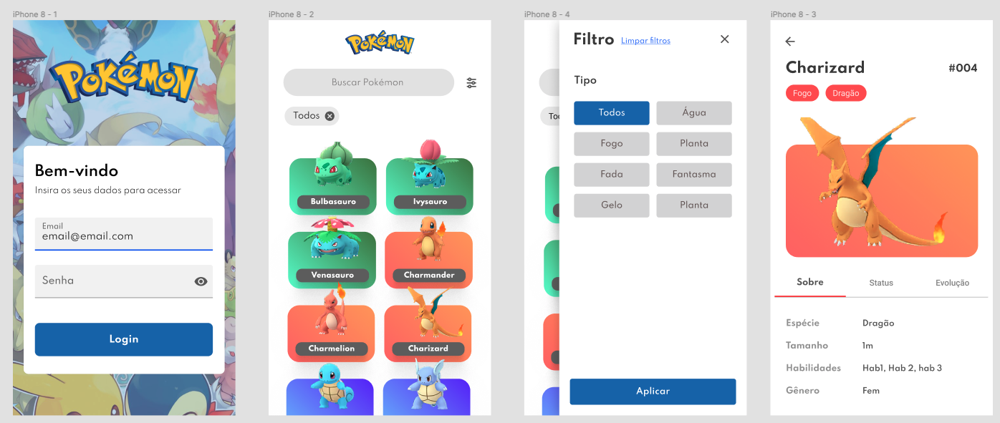

# Fase 2 - Desafio Full Stack

O desafio tem como objetivo avaliar a pessoa candidata nas experiências:

-   Criação de API
-   Validação de Login e sessão, na relação do back e front
-   Padrões no uso do React
-   Boas práticas de programação e organização de projeto

Vale lembrar que iremos avaliar tudo.

Não deixe de fazer a tarefa, pois conhecimento técnico é um dos pilares da Moodar e sabemos que conhecimento se adquire com o tempo.

### Desafio

Criar uma API Django Rest e front NextJS que simula uma Pokedex.

API

-   A API a ser embasada se encontra neste link: https://pokeapi.co/docs/v2#pokemon-section
-   Não será permitido inserir informações com URL. Deve-se inserir todas as informações possíveis.
-   As informações deverão ser inseridas num banco de dados em Mysql ou Postgres e a sua API deve usar o seu banco para consumo de dados. Crie um script para inserir todos os dados automaticamente. Não será permitido inserção manual.
-   Só deverá retornar qualquer informação se o usuário tiver um token de acesso

FRONT

-   Link para o Figma https://www.figma.com/file/943D2Dx1H3uEVBMast3hzt/Teste-Pokemon?node-id=0%3A1
-   Realizar login, validando email e senha com back Django Rest.
-   Manter o usuário logado no app após o login.
-   Scroll Infinito.
-   Armazene os dados que você achar mais importante para execução do app.

## Requisitos

### Obrigatório

-   TypeScript
-   Utilizar react navigation
-   Uso de containers Docker pra levantar tanto API quanto Front

### Opcionais:

-   Container local pra salvar a imagem dos Pokemons
-   JWT como login
-   Efeito na visualização dos Pokemons

### Como você deve nos enviar o desafio?

-   É de caráter obrigatório o registro de horas para análise (você pode usar softwares como https://getharvest.com, https://clockify.me/, etc).
-   Você deve enviar o desafio para `germanozaicaner@moodar.co` com título `Processo Seletivo Moodar - Fase 2 - Desafio Técnico - SeuNome`.
-   Gere um zip do seu projeto final e envie no email acima.
-   Detalhe toda a sua experiência, informando os pontos de desafio que você achou mais legal.
